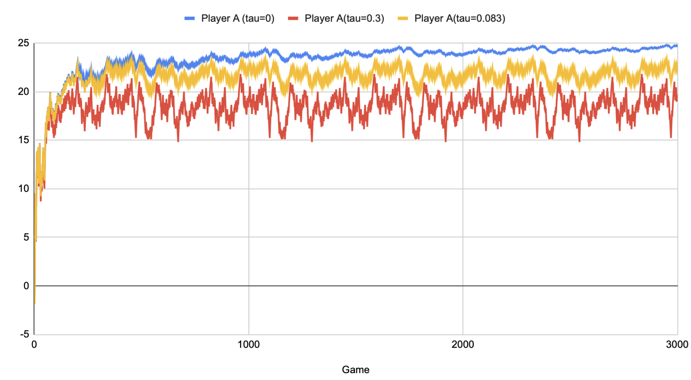
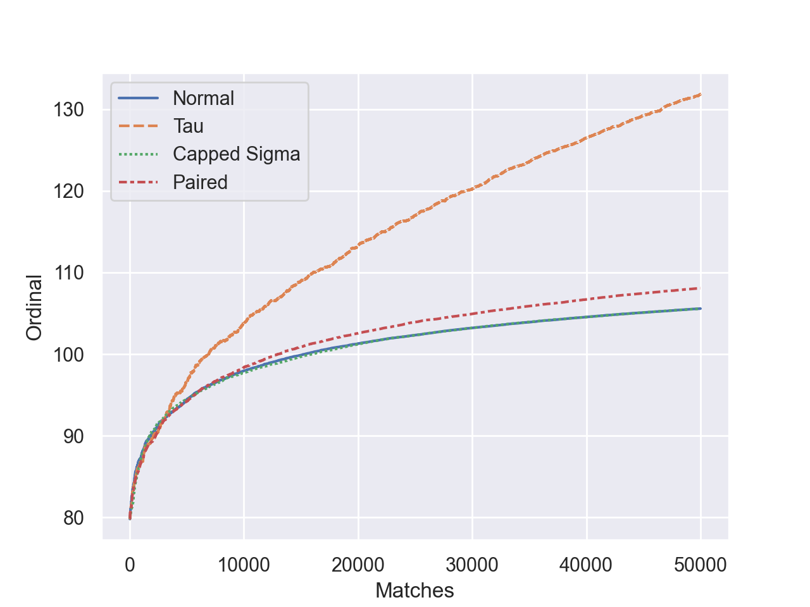

==============
Advanced Guide
==============

.. warning::

  These features have not been tested against real world data to check for their efficacy. You should test the parameters against your own data to ensure they suit your needs.

Additive Dynamics Factor
========================
If ``sigma`` gets too small, eventually the rating change volatility will decrease. To prevent this you can pass the parameter ``tau`` to :class:`~openskill.rate.rate`. ``tau`` should preferably be a small decimal of two significant digits.

Here are some visuals of how ordinals change with different ``tau`` values:

You can combine ``tau`` with another parameter ``prevent_sigma_increase`` to ensure the win probability always remains congruent with the actual win rate.

Here is how this looks:

Time Decay
==========

You can represent the decay of a player's skill over time by increasing ``sigma`` by a little per match not played (or every time interval). First collect data on by how much sigma goes up or down by resetting sigma to it's default value per interval. The value by which ``sigma`` should change must be an average of the change of ``sigma`` over all matches when ``sigma`` is reset per interval.

Here is an example of how to do this:

.. literalinclude:: time_decay.py

This will produce the following output:

.. code-block:: console

    Before Large Decay:
    Player X: mu=26.986479759996925, sigma=1.879261533806081
    Player Y: mu=22.87672143851661, sigma=1.879261533806081

    Predict Winner Before Decay:
    X has a  70.27% chance of winning over Y

    Player X's Rating After Decay:
    Player X: mu=26.983781247317594, sigma=5.101382249884723

    After Large Decay (1 Year):
    Player X: mu=28.199913286886318, sigma=4.958583411621401
    Player Y: mu=22.711677880164803, sigma=1.881565104224607

    Predict Winner After Decay:
    X has a  58.51% chance of winning over Y

